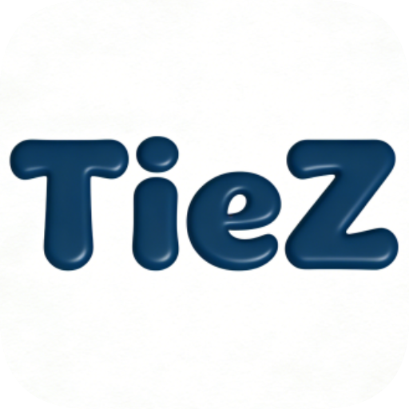

# TieZ Mobile - 跨平台剪贴板同步增强套件

<p align="center">
  
</p>

<p align="center">
  <strong>极简而不简单。捕捉每一份灵感，赋能每一次粘贴。</strong>
</p>

---

## 📱 项目简介

**TieZ Mobile** 是 [TieZ Clipboard Manager](https://github.com/jimuzhe/tiez-clipboard) 的移动端配套应用。它不是一个单纯的剪贴板工具，而是桌面端同步功能的**强力增强套件**。通过 WebDAV 协议，它实现了手机与 PC 之间近乎无感的内容流转。

## ✨ 核心特性

### 🚀 极致同步体验
- **Android 快捷磁贴**：下拉通知中心点一下，瞬间将手机剪贴板推送到 PC。
- **App Shortcuts**：长按应用图标，直达文件传输、获取 PC 内容或一键同步。
- **自动剪贴板接力**：获取 PC 内容后自动写入手机剪贴板，实现真正的“复制即粘贴”。

### 🎥 媒体与文件快传
- **相机扫码互传**：基于相机的极速局域网传输，告别繁琐连接。
- **高清视频预览**：支持视频原画传输，内置缩略图预览与流畅播放器。
- **Premium UI**：现代化的非对称圆角气泡设计，极致的毛玻璃视觉反馈。

### 🔒 私有云同步
- **WebDAV 原生支持**：数据存储在你自己控制的服务器（如坚果云、NAS 等），安全隐私。
- **按需加载优化**：智能缓存逻辑，极致省电与流量节省。

## 🛠 开发环境

本项目基于 **Expo (React Native)** 开发。

### 快速开始
1. **安装依赖**
   ```bash
   npm install
   ```

2. **启动开发服务器**
   ```bash
   npx expo start
   ```

3. **打包构建**
   项目已配置 **EAS Build** 自动化流水线：
   ```bash
   # Android 开发版安装包 (APK)
   eas build --platform android --profile preview
   
   # iOS 构建 (需开发者账号)
   eas build --platform ios
   ```

## 📦 自动化流程

我们通过 **GitHub Actions** 实现了 CI/CD：
- 每次推送代码至 `main` 分支，系统会自动触发云端构建。
- 构建结果可在 [Expo Dashboard](https://expo.dev/) 查看。

## 🤝 贡献与反馈

如果你在使用过程中有任何建议或发现了 Bug，欢迎提交 [Issue](https://github.com/jimuzhe/tiez-mobile/issues) 或 Pull Request。

---

**为简单而设计。Designed by TieZ Team.**
